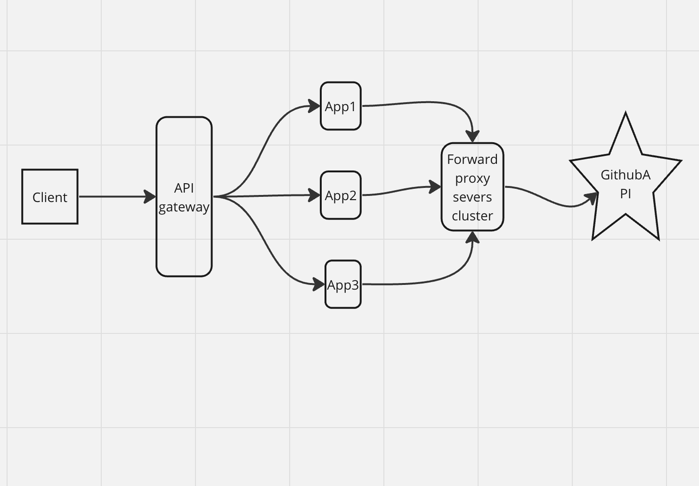

#  Redcare Pharmacy Repository service

Repository service for retrieving github repositories by providing different filters on the repositories

# Installations and getting started.

###  Prerequisites
- Java 19 already installed 
- Docker desktop installation completed and docker instance up
- no application is running on ports 9090, 3000, 3100, 8082 on your
  localhost.

###  Clone repository

    git clone [repository url]  or download shared zip file

###  Deploy Grafana, loki and Prometheus
To install observability tools, cd into the root of the project and run the following command

    docker compose up -d 

Check that you can access grafana and Prometheus by opening the following links

- Prometheus: http://localhost:9090/
-  Grafana: http://localhost:3000/

###  Build the application
cd to the cloned application root folder and run build -checking that the code coverage threshold has been set.

    ./gradlew build jacocoTestCoverageVerification 

###  Run tests

    ./gradlew clean test --info

###  Test Reports

    cd build/reports/tests/test/index.html

Test coverage reports

    cd build/reports/jacoco/test/html/index.html

###  Run application on dev machine.

Update application.properties

set the api key to a default value that you will be used to invoke the secured apis. (For dev its already set to below value)

    eg  api_key =b36c0f67-a54e-40e6-b4f6-c3982b1b5075

Start the application:

     ./gradlew bootRun  

Check that you can access actuator health url:

- Actuator health url : http://localhost:8082/actuator/health

###  Testing the service
Open swagger url http://localhost:8082/swagger-ui/index.html#/
Add the API key (by clicking on authorize button)

## sample request

`curl -X 'GET' \
'http://localhost:8082/api/v1/repositories?created=2019-01&language=java&sort=stars&order=desc&page=0&per_page=50' \
-H 'accept: */*' \
-H 'X-API-KEY: b36c0f67-a54e-40e6-b4f6-c3982b1b5075'`

Use request-id, response-token to query for traces in grafana loki by setting app as redpharma-repository-service-dev and Line contains filter -add requestID/responseToken(found in each response)

Test apis in the http://localhost:8082/swagger-ui/index.html#/

###  Production set up considerations

Update loki url in logback-spring to production url

### Key design considerations

## Non Functional Requirements

  The service should be secure
  High availability and low latency
  Be able to serve a high number of requests
  Must be production ready

## Out of scope:
  Authorization

## Tools and technologies
  Spring Boot 3.1.4
  Jacoco for code coverage
  Grafana, prometheus, loki, actuator for observability, app health information, log aggregation and distributed tracing
  Docker
  Gradle
  Deployment strategy blue green

## Project folder structure

  - Auth:  holds code related to spring security authentication logic
  - Config: holds configuration classes such as slfj mdc config, open api config  etc
  - Controller: holds our controller classes
  - Exceptions: holds custom exception classes
  - Filters: holds custom filter classes eg authentication filter
  - Repositories: Holds spring boot repository interfaces
  - dtos: holds our api public schemas for requests and responses
  - Services: holds our core business logic classes that are independent of any framework.
  - k8s: kubernetes yaml files
  - docker: grafana, loki, prometheus configuration files

## Production readiness
# Security:

  The service is secured by an api token.

  Assumptions made:

  We shall have an api gateway sitting in front of this API that will be responsible for authentication and ssl termination and forwarding http traffic with an api key header to service instances.

  The cluster where the service instances will be running will only be accessed by the api gateway servers and so the service will not need to authenticate other clients.

## Testing and code coverage

  I have added tests for different layers, repository,controller  and service layers.
  I have also set a test coverage threshold that should be observed by the team and can also be set to a higher number as a next step to help improve quality even further.

  Because of the time limit, I have given priority to happy paths.

  I have ensured that our business service layer has 100% test coverage.

## Exception handling

  I have added custom exceptions that get thrown in different stages in the life cycle of a request, these exceptions are then centrally handled by the base controller exception handler method and converted into a format that the frontend would easily consume.
  Observability, tracing and logging

  I have implemented the following
  
  Each request has a unique request id and response token that can be used to trace the request lifecycle
  Added the application host in the log to make it easy to know which server processed the request
  Implemented a log pattern that has the servicename, traceid, host.
  Enabled and exposed actuator endpoints to get insights into health of the application and other metrics such as memory usage, JVM metrics etc
  
  I have added Loki, grafana, prometheus for log aggregation, storage, performing queries (eg with request request ids ) and visualizing trends

## Liveness and readiness probes endpoint

  Since our service will be deployed in kubernetes clusters, I have also added liveness and readiness kubernetes probes.

## Deployment
  I have added kubernetes deployment files to make the application ready for the deployment step using blue green deployment

  I plan to used blue green deployment strategy to ensure that there's no downtime at the time we are adding new features in production.
## Api and contract documentation
  I have exposed a secured swagger documentation

## High level design.

  

## Improvements/next steps
  - Improve test coverage
  - a2e tests.
  - perform load testing

